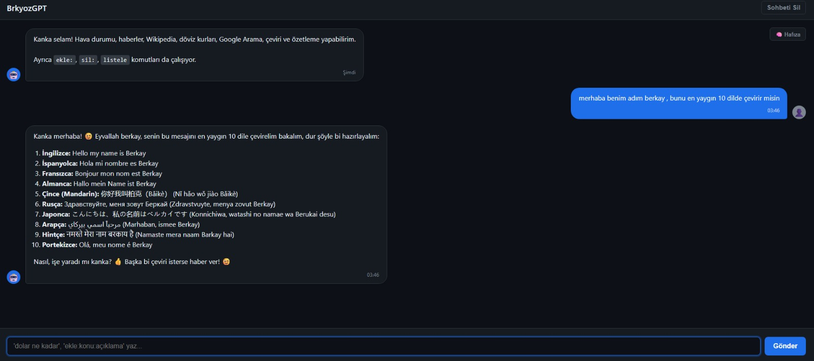
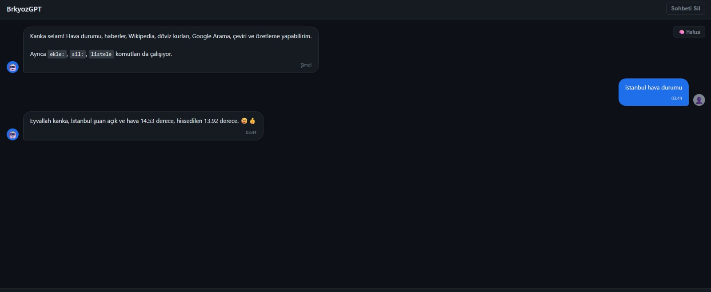
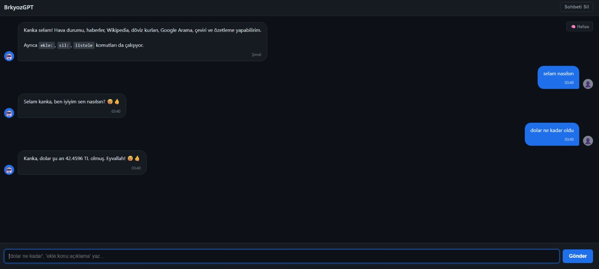
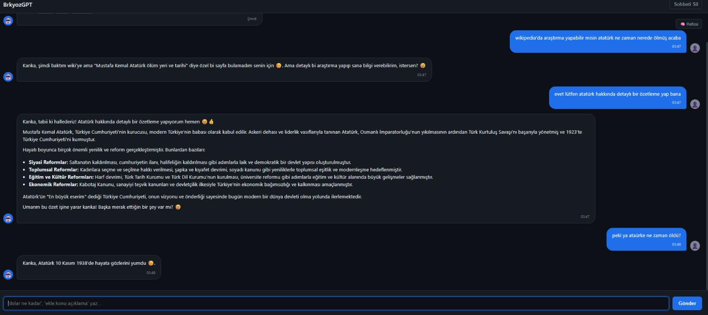
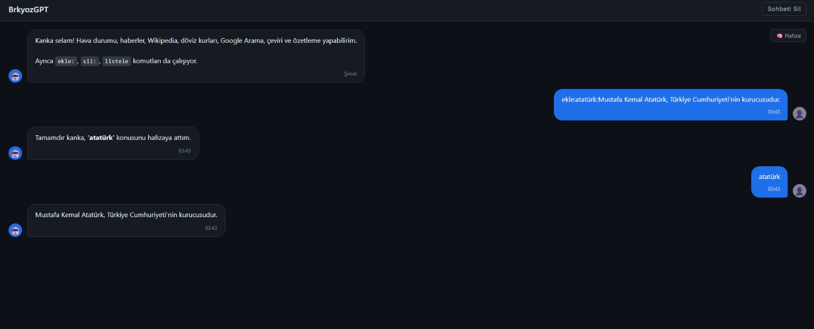
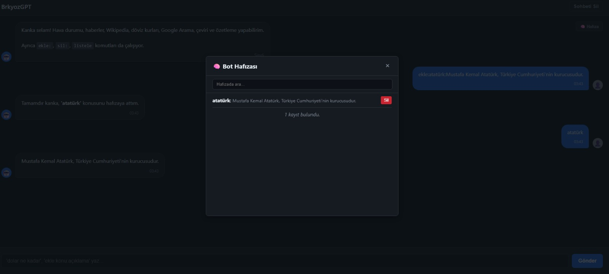

# 🧠 BrkyozGPT - Veritabanı Entegreli Yapay Zeka Asistanı

> **"Yapay zeka, insan zekasının bir yansımasıdır; onu nasıl eğittiğin geleceği belirler."**

BrkyozGPT, **Google Gemini LLM** altyapısını kullanan, **5 farklı harici API** ile güçlendirilmiş ve **SQL tabanlı kalıcı hafıza yönetimine** sahip gelişmiş bir yapay zeka asistanıdır.

⚠️ *Proje şahsi Ar-Ge çalışmasıdır ve ticari API anahtarları içerdiğinden kaynak kodları kapalıdır. Aşağıda teknik mimari ve yetenekler sergilenmiştir.*

## 🛠️ Teknik Altyapı (Tech Stack)

Proje, modern web teknolojileri ve N-Tier (Çok Katmanlı) mimariye uygun olarak tasarlanmıştır.

* **Core AI:** Google Gemini Pro API (Doğal Dil İşleme ve Üretim)
* **Backend:** ASP.NET Core Web API & C#
* **Veritabanı:** Microsoft SQL Server (MSSQL)
* **ORM:** Entity Framework Core 
* **Frontend:** HTML5, CSS3 (Dark Mode UI), JavaScript (AJAX)
* **Entegrasyonlar:** RESTful API Mimarisi

## 🚀 Temel Yetenekler ve Modüller

Sıradan bir chatbot'tan farklı olarak BrkyozGPT, kullanıcının niyetini analiz eder ve veritabanı ile konuşarak kişiselleştirilmiş cevaplar üretir.

### 1. 🔗 Çoklu API Entegrasyonu (Multi-Agent System)
Sistem, kullanıcının sorusunu analiz eder ve gerekirse dış dünyadan canlı veri çeker:
* **⛅ Hava Durumu:** Anlık lokasyon bazlı hava durumu verisi.
* **💰 Finans:** Canlı döviz kurları ve piyasa takibi.
* **📚 Wikipedia:** Geniş çaplı bilgi taraması ve özetleme.
* **🌍 Çeviri:** 100+ dil arasında anlık çeviri yeteneği.

### 2. 🧠 SQL Tabanlı Kalıcı Hafıza (Persistent Memory)
LLM'lerin "unutma" sorununu çözmek için **MSSQL** üzerinde çalışan özel bir hafıza katmanı geliştirildi.
* **Öğrenme Modülü:** `ekle:konu:açıklama` komutu ile girilen veriler **SQL veritabanına** yapısal olarak kaydedilir.
* **RAG Mimarisi:** Bot, cevap verirken önce veritabanını (Database) sorgular; eğer konuyla ilgili kayıtlı bir bilgi varsa (Örn: "Atatürk kimdir?"), cevabı veritabanından getirir.
* **CRUD İşlemleri:** Kullanıcı, botun hafızasındaki verileri listeleyebilir veya silebilir.

### 3. 🎨 Modern UI/UX Tasarımı
* Göz yormayan **Dark Mode** arayüz.
* Akıcı sohbet baloncukları ve animasyonlar.
* Mobil uyumlu (Responsive) tasarım.

---

## 📸 Proje Görselleri

### 🔹 Ana Sohbet ve Çoklu Dil Çeviri
Botun doğal dil işleme yeteneği ve dil çeviri modülü.

### 🔹 Canlı Veri Erişimi: Hava Durumu & Finans
API entegrasyonları sayesinde anlık veri çekebilme kabiliyeti.

### 🔹 Araştırma Modülü: Wikipedia Entegrasyonu
Kullanıcının sorduğu konuları ansiklopedik kaynaklardan tarayıp özetleyen sistem.

### 🔹 Hafıza Yönetimi (SQL Database Integration)
Kullanıcı tarafından öğretilen bilgilerin veritabanına kaydedilmesi süreci.

### 🔹 Hafıza Paneli
SQL veritabanından çekilen kayıtların listelendiği yönetim paneli.

---
*Developed by Mehmet Berkay Özdemir - Powered by Google Gemini, .NET Core & MSSQL*
